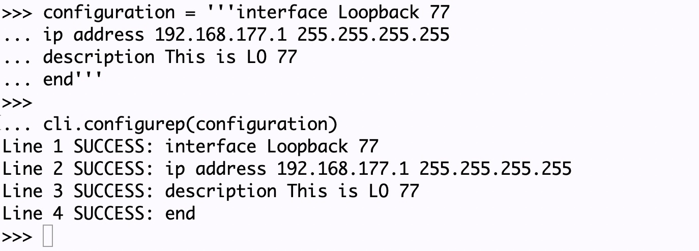

## DevNet 2556 - Python on IOS-XE

### TABLE OF CONTENTS
* Module 1 - [Verifying Guest Shell Operation](Module1)
* Module 2 - [Interactive Python Prompt](Module2)
* Module 3 - [Python API](Module3)
* Module 4 - [Python Script](Module4)
* Module 5 - [Embedded Event Manager](Module5)
* Module 6 - [NETCONF & YANG](Module6)
* Module 7 - [Bringing It All Together](Module7)


### Module 3 - Python API

A built-in module for the Python interpreter embedded in IOS-XE is a new Python API which permits Python calls to use CLI commands directly and return the results.  This allows users to leverge the power of Python with the experience of programming IOS through CLI.  

The following commands are available through the Python API:

**cli.cli(command)** - takes an IOS command as an argument, runs through the IOS parser, and returns the result

**cli.clip(command)** - takes an IOS command as an argument, runs through the IOS parser, and prints the result

**cli.execute(command)** - executes a single exec command and returns the result

**cli.executep(command)** - executes a single exec command and prints the result

**cli.configure(command)** - configures the device with the command, multiple commands can be separated by commas, and it returns the result

**cli.configurep(command)** - configures the device with the command, multiple commands can be separated by commas, and it prints the result


--------------------------------
Let's test some of these out.  Copy the content in the grey box below 

```
import cli
cli.cli("show ip int brief")
```

You will see the output of a typical CLI command
```
'\nInterface              IP-Address      OK? Method Status                Protocol\nGigabitEthernet1       10.0.2.15       YES DHCP   up                    up      \nLoopback0              192.168.200.255 YES manual up                    up      \nVirtualPortGroup0      192.168.35.1    YES NVRAM  up                    up      \n'
```

However, notice the format is difficult to read.  Maybe it would be better to return it printed rather than as a simple return. Let's try using this one instead.

```
cli.clip("show ip int brief")
```

Now the output is cleaner!


Let's try some other commands.  Now we're going to add an interface to the device.  We could use the same `cli.cli()` command and then verify the result as a simple exercise.

Copy the content from the grey box below and paste that into the device.

```
cli.cli("conf t; int loo 66; ip address 198.168.166.1 255.255.255.255")
cli.clip("show ip int brief")
```
We see the result, and notice that Loopback 66 has been added, but we needed a second command to verify the result.


If we use the `cli.configure()` command, we can get immediate feedback as to if the command worked and which parts were successful.

Copy the content from the grey box below and paste that into the device.

```
cli.configurep(["interface Loopback 77", "ip address 192.168.177.1 255.255.255.255", "end"])
```
Now we see a result from each command in the list.



This demonstrates some simple uses of the Python API.  In the next section we will see how some of this can be used in a more programmatic fashion.

### [Next Step - Module 4 - Python Script](www.github.com/rshoemak/DevNet2556/Module4)
