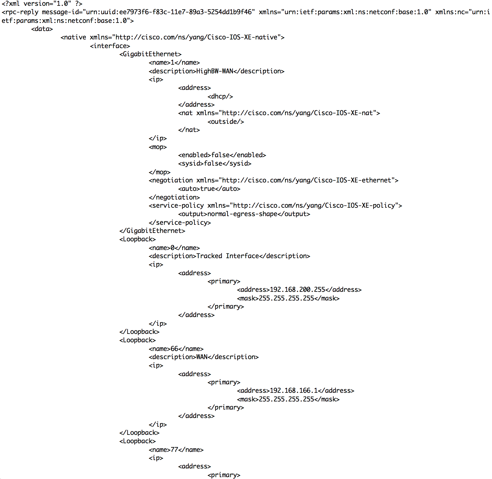

## DevNet 2556 - Python on IOS-XE

### TABLE OF CONTENTS
* Module 1 - [Verifying Guest Shell Operation](Module1.md)
* Module 2 - [Interactive Python Prompt](Module2.md)
* Module 3 - [Python API](Module3.md)
* Module 4 - [Python Script](Module4.md)
* Module 5 - [Embedded Event Manager](Module5.md)
* Module 6 - [NETCONF & YANG](Module6.md)
* Module 7 - [A Deeper Look at NETCONF](Module7.md)
* Module 8 - [Bringing It All Together](Module8.md)


### Module 7 - A Deeper Look at NETCONF

We've explored using Python to program IOS-XE by extracting data using both the CLI library and with NETCONF.  Let's take a deeper look at extracting data from an IOS-XE device using NETCONF.

Let's start by exploring the data nodes that should be part of any interface inside the Cisco IOS-XE Native YANG model.   If we take a simple script and leverage the Cisco-IOS-XE-Native YANG model, but then ask only for those data elements that exist inside the "Interface" node, we can determine what is structured for our use.  

We will do this by using the following Python script:

```python
#!/usr/bin/env python
#
# Get interface elements using Netconf and Cisco-IOS-XE-Native YANG model
#
# rshoemak@cisco.com
#

from ncclient import manager
import sys
import xml.dom.minidom as DOM


# the variables below assume the user is leveraging a
# Vagrant Image running IOS-XE 16.7 on local device
HOST = '192.168.35.1'
# use the NETCONF port for your IOS-XE
PORT = 830
# use the user credentials for your IOS-XE
USER = 'vagrant'
PASS = 'vagrant'


def main():
    """
    Main method that retrieves the node list of the interface node via NETCONF.
    """
    with manager.connect(host=HOST, port=PORT, username=USER,
                         password=PASS, hostkey_verify=False,
                         device_params={'name': 'default'},
                         allow_agent=False, look_for_keys=False) as m:

        # XML filter to issue with the get operation
        hostname_filter = """
                        <filter>
                            <native xmlns="http://cisco.com/ns/yang/Cisco-IOS-XE-native">
                                <interface></interface>
                            </native>
                        </filter>
                        """

        result = m.get_config('running', hostname_filter)
        print(DOM.parseString(result.xml).toprettyxml())


if __name__ == '__main__':
    sys.exit(main())
```
    
Taking a look at this program, it looks very similar to the one we just went through in module 6.  One key difference is that we've slightly modified the filter.  Now instead of looking at all the nodes contained inside the running-config of an IOS-XE device using the Cisco-IOS-XE-Native YANG model, we've asked the program to only return that data nested inside the "interface" node.  This type of nesting allows our programs to operate better in that we can be very specific about which parts of the data structure we want to search for information.  

Copy the command inside the grey box below and paste that into the device prompt.

```
guestshell run python /flash/get_interface_YANG_elements.py
```
The returned output is an XML formatted display of all the elements that is contained inside that YANG model structure.  Here is a snippet of what comes back.



If we need to collect a node of data from something inside this returned XML data structure, then we can use Python to find the correct node, and then assign that value to a variable.  

Let's look at one more program that will show how we can leverage this NETCONF returned data structure to extract the information we need.  In particular, let's use NETCONF to return values for each interface's name, description, and IP address.  

We will do this by using the following Python script:

```python
#!/usr/bin/env python
#
from ncclient import manager
import sys
import xml.dom.minidom as DOM

# the variables below assume the user is leveraging a
# Vagrant Image running IOS-XE 16.7 on local device
HOST = '192.168.35.1'
# use the NETCONF port for your IOS-XE
PORT = 830
# use the user credentials for your IOS-XE
USER = 'vagrant'
PASS = 'vagrant'
# YANG filter
NS = """
    <filter>
        <native xmlns="http://cisco.com/ns/yang/Cisco-IOS-XE-native">
            <interface></interface>
        </native>
    </filter>
    """


class IntInfo():
    def __init__(self, name, description):
        self.name = name
        self.description = description


def connect(xml_filter):
    """
    Open connection using IOS-XE Native Filter
    """
    with manager.connect(host=HOST, port=PORT, username=USER,
                         password=PASS, hostkey_verify=False,
                         device_params={'name': 'default'},
                         allow_agent=False, look_for_keys=False) as m:

        return(m.get_config('running', xml_filter))


def get_int_info(int):
    name_obj = int.getElementsByTagName("name")[0]
    name = name_obj.firstChild.nodeValue

    if len(int.getElementsByTagName("description")) != 1:
        description = "empty"
    else:
        description_obj = int.getElementsByTagName("description")[0]
        description = description_obj.firstChild.nodeValue

    return IntInfo(name, description)


def main():
    interfaces = connect(NS)

    doc = DOM.parseString(interfaces.xml)
    node = doc.documentElement

    gigs = doc.getElementsByTagName("GigabitEthernet")
    for GE in gigs:
        ints = get_int_info(GE)
        print("GigabitEthernet%s, description: %s" % (ints.name, ints.description))

    loops = doc.getElementsByTagName("Loopback")
    for LO in loops:
        ints = get_int_info(LO)
        print("Loopback%s,        description: %s" % (ints.name, ints.description))


if __name__ == '__main__':
    sys.exit(main())
``` 
In this script, we've built upon some of the earlier modules' scripts.  Several elements should look familiar.  

1. We continue to use the ncclient module to retrieve information via NETCONF.  And again we are leverage the 'get_config' data retrieval option.
2. We've moved the `xml_filter` up to the global variables section to make it easier to identify, but we have modified it from the previous modules so that it will only return the information nested inside the `interface` section of the YANG model.
3. We've broken to script into several definitions (routines) so that the main function can iterate through both the `GigabitEthernet` interfaces and the `Loopback` interfaces.  
4. We've also shown how the data can be returned as an object by using a class identifier for `IntInfo`.  This would make it easier to structure the data if we needed to gather it for many devices or many interfaces inside a device.

Copy the command inside the grey box below and paste it into the device prompt.

```
guestshell run python /flash/get_int_info.py
```
The output from this script is the following:

```
devnet2556#guestshell run python /flash/get_int_info.py
GigabitEthernet1, description: WAN
Loopback0,        description: Tracked Interface
Loopback66,        description: empty
```


Now for the final module, let's bring all of these components together!

### [Next Step - Module 8 - Bringin It All Together](Module8.md)

