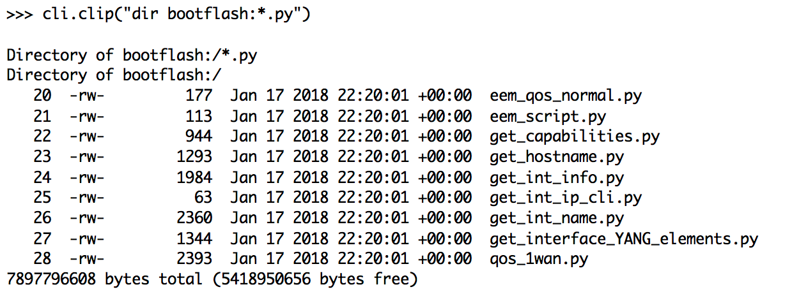

## DevNet 2556 - Python on IOS-XE

### TABLE OF CONTENTS
* Module 1 - [Verifying Guest Shell Operation](Module1.md)
* Module 2 - [Interactive Python Prompt](Module2.md)
* Module 3 - [Python API](Module3.md)
* Module 4 - [Python Script](Module4.md)
* Module 5 - [Embedded Event Manager](Module5.md)
* Module 6 - [NETCONF & YANG](Module6.md)
* Module 7 - [A Deeper Look at NETCONF](Module7.md)
* Module 8 - [Bringing It All Together](Module8.md)


### Module 4 - Python Script

For this module, we will explore using a Python script to execute the Python API.  

Let's first check to make sure the Python scripts are on the device's flash memory.  Copy the command in the grey box below and paste into the device.

```
cli.clip("dir bootflash:*.py")
```
There will be several Python scripts stored in the directory.



The one we will be using for this section is `get_int_ip_cli.py`

It is a simple python script of just three lines:

```python
import cli

output = cli.cli("show ip int brief")
print(output)
```
In order to execute our Python scripts however, we will need to exit the Python interpreter and run the scipt from CLI.  Exit the Python interpreter by copying the command in the grey box below and pasting it into the device prompt.

```
exit()
```

From the device's prompt, we will execute the command.  Copy the content from the box below and paste it into CLI.

```
guestshell run python /flash/get_int_ip_cli.py
```
The returned result will show the various interfaces in the device.


This shows how to run a simple Python script to get output.  

### [Next Step - Module 5 - Embedded Event Manager](Module5.md)


