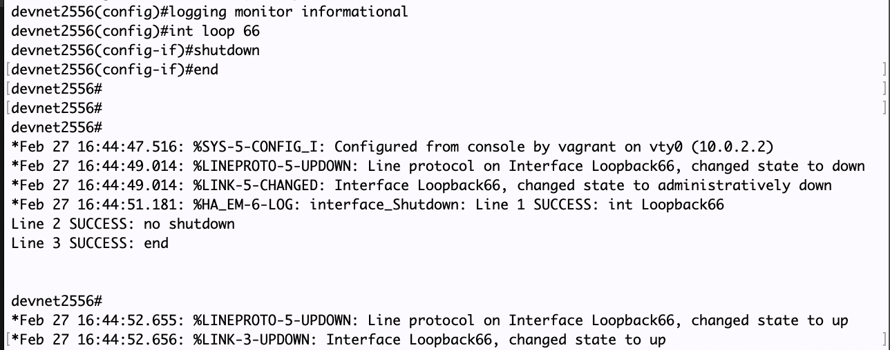

## DevNet 2556 - Python on IOS-XE

### TABLE OF CONTENTS
* Module 1 - [Verifying Guest Shell Operation](Module1.md)
* Module 2 - [Interactive Python Prompt](Module2.md)
* Module 3 - [Python API](Module3.md)
* Module 4 - [Python Script](Module4.md)
* Module 5 - [Embedded Event Manager](Module5.md)
* Module 6 - [NETCONF & YANG](Module6.md)
* Module 7 - [A Deeper Look at NETCONF](Module7.md)
* Module 8 - [Bringing It All Together](Module8.md)


### Module 5 - Embedded Event Manager

One of the primary use cases for the Python container on IOS-XE is utilizing it in conjunction with an Embedded Event Manager (EEM) event.  

We will use the python script `eem_script.py` for this module.  

```python
import sys
import cli
 
intf = sys.argv[1:]
intf = ''.join(intf[0])

cli.cli("conf t; int %s; no shutdown; end" %intf)
```

In order to execute this script, we need to create an EEM policy in CLI.  Copy the content from the grey box below and paste that into the device prompt.


```
conf t
event manager applet interface_Shutdown
 event syslog pattern "Interface Loopback66, changed state to administratively down"
 action 0.0 cli command "en"
 action 1.0 cli command "guestshell run python /flash/eem_script.py Loopback66"	
!
end
```

Note how shutting down Loopback66 will automatically execute the Python script.  Let's see it in action!  Copy the commands from the grey box and paste them into the device prompt.  

```
term mon
conf t
int loop 66
shutdown
end

```
With `term mon` enabled, you can monitor the Syslog messages, and note how the Loopback interface gets shutdown, but then re-enabled as the EEM script is executed.



### [Next Step - Module 6 - NETCONF & YANG](Module6.md)
